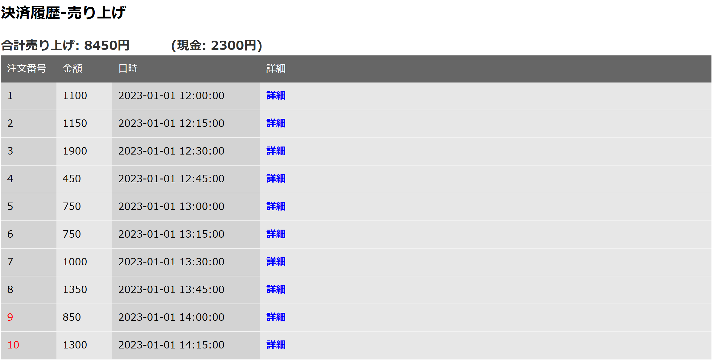
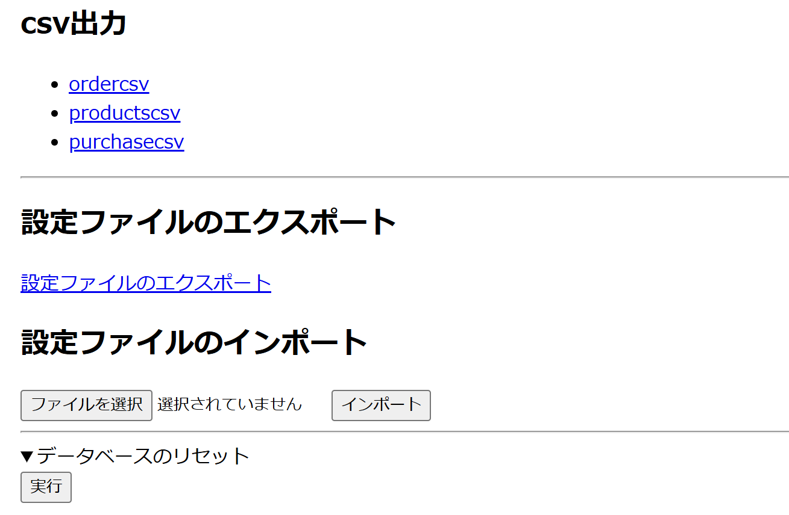

# 画面単位技術仕様

## 概要

ここでは個々細かな技術仕様が記載されています。

## 目次

- [画面単位技術仕様](#画面単位技術仕様)
  - [概要](#概要)
  - [目次](#目次)
  - [HOMEの説明](#homeの説明)
  - [Adminの説明](#adminの説明)
    - [商品の追加-編集](#商品の追加-編集)
    - [カテゴリの追加-編集](#カテゴリの追加-編集)
    - [決済履歴-売り上げの表示](#決済履歴-売り上げの表示)
    - [機能の設定](#機能の設定)
    - [その他](#その他)
  - [呼び出しパネルの説明](#呼び出しパネルの説明)
    - [呼び出しパネル](#呼び出しパネル)
    - [呼び出しパネル(調理中)](#呼び出しパネル調理中)
    - [呼び出しパネル(完了)](#呼び出しパネル完了)
  - [キッチン管理画面の説明](#キッチン管理画面の説明)
  - [Cash register](#cash-register)

## HOMEの説明

URL > `localhost:8080`

## Adminの説明
URL > `localhost:8080/adminUI/admin.php`  

### 商品の追加-編集  
URL > `localhost:8080/adminUI/admin.php#product-editor`  
商品をproductsテーブルに追加します。

- 商品コード：一意な任意の文字列を割り当ててください。
- 商品名：任意の商品名を入力してください。
- カテゴリ名：登録済みカテゴリから選択してください。
- 価格：商品の価格を入力してください。
- 在庫数：商品の在庫数を入力してください。

### カテゴリの追加-編集
URL > `localhost:8080/adminUI/admin.php#category-editor`  

- カテゴリ名：任意のカテゴリ名を入力してください。
- 重み付け：カテゴリの重み付けを入力してください。（レジ画面で重みが小さいものから順に表示されます。0は非表示を示します）
- すべて保存をクリックするとその時点で画面に映っている内容で保存されます。
- 追加する際は同様に追加用のエリアに入力し、カテゴリ追加ボタンを押してください。
- 削除する際は削除したいカテゴリの行の削除ボタンを押してください。
### 決済履歴-売り上げの表示
URL > `localhost:8080/adminUI/admin.php#payment-log`  

- 上部に合計金額と現金決済分の金額が表示されます。
- 表に決済履歴が表示されます。
- 注文番号は自動で設定される一意な値です。
- 注文番号が赤く表示されているものは、決済が完了していないものです。（合計金額には含まれません）
- 詳細をクリックすることで該当する注文の詳細を表示します。

**詳細ポップアップ**

- 注文ID：一意な値です。
- 呼び出し番号：呼び出しパネルに表示される番号です。(一意ではない場合があります)
- 支払い方法：決済方法を表示します。（電子決済の場合完了したかも表示されます）
- 提供状況：注文の状態を表示します。変更して更新すると状態が変更されます。
- 注文日：注文が行われた日時を表示します。
- 購入商品一覧：購入した商品の一覧を表示します。
- レシートの印刷ボタンはサーマルプリンターを有効化している場合のみ表示されます。クリックすることでレシートの再発行ができます。

### 機能の設定  

URL > `localhost:8080/adminUI/admin.php#function-toggle`  

- 更新ボタン：設定を保存します。
- 支払い方法：利用可能な決済方法を選択します。
- サーマルプリンター ：サーマルプリンターを有効化します。
- 合成音声：合成音声を有効化します。
- ずんだもん：ずんだもんを有効化します。（無効化するとカスタム音源が使えます）
- 店舗名：店舗名を設定します。
- TOKEN：スクエアターミナルのトークンを設定します。
- DEVICEID：スクエアターミナルのデバイスIDを設定します。
- Printer IP：サーマルプリンターのIPアドレスを設定します。
- 印刷テスト：サーマルプリンターの印刷テストを行います。

### その他  

URL > `localhost:8080/adminUI/admin.php#other-settings`  

- csv出力：データベース内の各テーブルをCSV形式で出力します。
- 設定ファイルのエクスポート：設定ファイルをjson形式でエクスポートします。
- 設定ファイルのインポート：設定ファイルをjson形式でインポートします。
- データベースのリセット：データベースを初期化します。

## 呼び出しパネルの説明

### 呼び出しパネル

URL > `localhost:8080/announcementPanel/full.php`

### 呼び出しパネル(調理中)

URL > `localhost:8080/announcementPanel/division1.php`

### 呼び出しパネル(完了)

URL > `localhost:8080/announcementPanel/division2.php`

## キッチン管理画面の説明

URL > `localhost:8080/kitchenUI/kitchen_mng.php`

## Cash register  

URL > `localhost:8080/register/register.php`  
