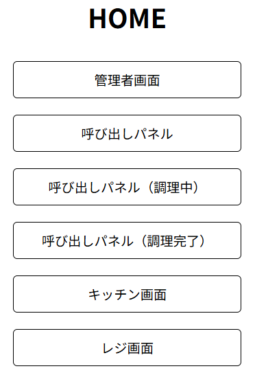

# \[IwaPos] 取扱説明書

*バージョン: \[バージョン番号]*
*作成日: \[作成日]*

---

## 1. 目次

## 2. はじめに

このドキュメントは、\[IwaPos] の基本的な使い方から応用的な機能までを説明します。本ソフトウェアを初めてお使いになる方、より深く理解したい方を対象としています。

### 2.1. 本取扱説明書の読み方

* 本書は、\[IwaPos] のバージョン \[バージョン番号] に基づいて記述されています。
* 操作手順は、原則として上から順番に実行してください。
* 画面表示や入力項目は、`コード記法` で示します。
* 重要な注意点やヒントは、箇条書きや引用ブロック (`>`) を用いて記述します。

> **注:** \[ここに注意点を記述]

---

## 3. \[IwaPos] について

### 3.1. ソフトウェアの概要

\[ソフトウェアの簡単な説明、主な機能、何ができるかなどを記述]

### 3.2. 主な機能

* 機能A: \[機能Aの簡単な説明]
* 機能B: \[機能Bの簡単な説明]
* 機能C: \[機能Cの簡単な説明]

---

## 4. システム要件とインストール

### 4.1. システム要件

本ソフトウェアを使用するためには、以下の環境が必要です。

* OS:
  * \[OS名とバージョン例]
  * \[OS名とバージョン例]
* ハードウェア:
  * CPU: \[推奨スペック]
  * メモリ: \[推奨スペック]
  * ストレージ: \[必要な空き容量]
* その他:
  * \[依存ソフトウェアなど]

### 4.2. インストール方法

1. \[IwaPos] の公式サイトからインストーラーをダウンロードします。
    \[ダウンロードURL]
2. ダウンロードしたファイル `[ファイル名]` を実行します。
3. 画面の指示に従ってインストールを進めます。
4. インストール先フォルダを指定します（デフォルト: `[デフォルトパス]`）。
5. \[インストール完了までの手順を詳細に記述]

---

## 5. 基本的な使い方

### 5.1. ソフトウェアの起動

webページへアクセスする

## 6. HOME画面の説明

  
URL > <http://localhost:8080/>  

こちらのページでは管理者画面やキッチン画面へ飛ぶためのショートカットを提供します。  
遷移先については各セクションを参照してください。  

---

## 7. Adminの説明

### 7.1. 商品の追加-編集

URL > <http://localhost:8080/adminUI/admin.php#product-editor>  

### 7.2. カテゴリの追加-編集

URL > <http://localhost:8080/adminUI/admin.php#category-editor>

### 7.3. 決済履歴-売り上げの表示

URL > <http://localhost:8080/adminUI/admin.php#payment-log>

### 7.4. 機能の設定  

URL > <http://localhost:8080/adminUI/admin.php#function-toggle>  

### 7.5. その他  

URL > <http://localhost:8080/adminUI/admin.php#other-settings>

---

## 8. 呼び出しパネルの説明
現在の調理状況を表示します  
キッチン管理画面から調理状況は変更できます  
※画面の大きさによってある程度文字の配列は変わりますが極端に大きい・小さい場合意図しない動きをする場合があります
### 8.1. 呼び出しパネル(大)

URL > <http://localhost:8080/announcementPanel/full.php>  

### 8.2. 呼び出しパネル(調理中)

URL > <http://localhost:8080/announcementPanel/division1.php>

### 8.3. 呼び出しパネル(完了)  

URL > <http://localhost:8080/announcementPanel/division2.php>  

---

## 9. キッチン管理画面の説明

### 9.1. キッチン管理画面

URL > <http://localhost:8080/kitchenUI/kitchen_mng.php>

---

## 10. Cash registerの説明
商品の購入から支払いまでをスムーズにします  
画面左上：画面の色を変えれます(ライト/ダーク)  
画面右上：合計金額と支払いへ進むボタンがあります  
Admin-商品追加・カテゴリ追加から追加された商品を表示します  
商品の購入には商品枠内の(+/-)ボタンを押します  
会計するボタンを押すとAdmin-機能設定で設定された支払い方法が表示されます  
支払い方法を選択したら支払い待機画面が表示されます  
支払い待機画面では支払いの完了及びキャンセルが選択可能です  
(キャンセルをした場合支払い方法選択画面へ戻ります)  
プリンターがある場合は完了を押したら支払い完了になります  
プリンターがない場合は案内番号(任意)を入力した後完了となります  
(指定した番号と紙等で渡す番号は間違えないよう注意してください)
### 10.1. Cash register

URL > <http://localhost:8080/register/register.php>

---

## 11. これ以下はメモ

## 12. 応用的な使い方・ヒント

[より便利に使うための高度な機能、ショートカット、応用例などを記述]

---

## 13. トラブルシューティング

ソフトウェアの使用中に発生する可能性のある問題と、その解決策をまとめました。

### 13.1. [問題1]: [問題の簡単な説明]

* **原因**: [考えられる原因]
* **解決策**:
    1. [解決策1]
    2. [解決策2]

### 13.2. [問題2]: [問題の簡単な説明]

* **原因**: [考えられる原因]
* **解決策**:
    1. [解決策1]

---

## 14. FAQ (よくある質問)

Q: [質問1]?
A: [回答1]

Q: [質問2]?
A: [回答2]

---

## 15. 用語集

---

## 16. 付録

### 16.1. ライセンス情報

[ライセンス情報を記述]

### 16.2. 問い合わせ先

[問い合わせ先の情報 (メールアドレス、Webサイトなど) を記述]

---

## 17. 改訂履歴

| 日付   | バージョン | 変更内容       |
| :----- | :--------- | :------------- |
| [日付] | [vX.Y.Z]   | 初版作成       |
| [日付] | [vX.Y.Z]   | [変更点の概要] |
| [日付] | [vX.Y.Z]   | [変更点の概要] |
