# \[IwaPos] 取扱説明書

*バージョン: \[バージョン番号]*
*作成日: \[作成日]*

---

## 1. 目次

## 2. はじめに

このドキュメントは、\[IwaPos] の基本的な使い方から応用的な機能までを説明します。本システムを初めてお使いになる方、より深く理解したい方を対象としています。

### 2.1. 本取扱説明書の読み方

* 本書は、\[IwaPos] のバージョン \[バージョン番号] に基づいて記述されています。
* 操作手順は、原則として上から順番に実行してください。
* 画面表示や入力項目は、`コード記法` で示します。
* 重要な注意点やヒントは、箇条書きや引用ブロック (`>`) を用いて記述します。

> **注:** \[ここに注意点を記述]

---

## 3. \[IwaPos] について

### 3.1. システムの概要

学園祭などの小規模な物販で販売時点管理をするシステムです。  
在庫管理、売上追跡、電子決済導入などの機能を提供します。  

### 3.2. 主な機能

* 電子決済の導入: SquareTerminalと連携することで電子決済を導入出来ます。
* 在庫管理: 販売数に応じて在庫数を減らします。
* 呼び出し番号の読み上げ: 賞品完成時に呼び出し番号を読み上げます。

---

## 4. システム要件とインストール

### 4.1. システム要件

本システムを使用するためには、以下の環境が必要です。

* OS :
  * Linux :  
    * Ubuntu Server 22.04 LTS
    * CentOS Stream 9
    * Debian 11(Bullseye)
  * macOS :  
    * macOS Ventura(13)以降
  * Windows :  
    * Windows 10 Pro/Enterprise(64bit)以降
    * Windows Server 2019 以降  
* ハードウェア :
  * CPU :  
    * デュアルコア以上のプロセッサ
    * Intel Core i3 以上の世代、または同等性能のAMDプロセッサ
  * メモリ :  
    * 4GB以上(8GB推奨)
    * コンテナの構成やアプリケーションの処理内容によって変動しますが、余裕を持たせることを推奨します。
  * ストレージ :  
    * 20GB以上の空き容量
    * Dockerイメージ、コンテナ、データベースファイルなどの保存領域として必要です。データベースの規模が大きくなる場合は、より多くの空き容量を見積もってください。
* その他:
  * Docker :
    * Docker Engine 20.10 以降
    * Docker Compose 2.0 以降
    * コンテナの管理とオーケストレーションに必要です。
  * ネットワーク環境 :  
    * インターネット接続(Dockerイメージのダウンロードなどに必須)
  * Webブラウザ :  
    * 管理画面やレジ機能全般へのアクセスに必要です。

### 4.2. インストール方法

1. githubから\[IwaPos]リポジトリを`clone`します。
    [リポジトリ](https://github.com/kurappy-14/iwasakiPosSystem)
2. リポジトリのrootディレクトリで `docker compose up` を実行します。
3. ブラウザから<http://localhost:8080>へアクセスします。

---

## 5. 基本的な使い方

### 5.1. ご利用の流れ(setup)

1. webページへ[アクセス](http://localhost:8080)する
2. `管理者画面`から商品の追加/オプションの選択
3. レジでは`レジ画面`を表示
4. キッチンでは`キッチン画面`を表示
5. 呼び出し用モニタに`呼び出しパネル`を表示

### 物販の流れ

1. レジでは`レジ画面`に従い商品の登録/支払いの完了
2. キッチンでは`キッチン画面`に表示される商品を用意
3. 提供可能状態になり次第、ステータスを`提供待ち`へ(呼び出しパネルではステータス`完了`へ自動変更)
4. 提供完了後ステータスを`完了`へ変更

> **注:** 詳細については各対応するセクションをお読みください。

---

## 6. HOME画面の説明

URL > <http://localhost:8080/>  
  
こちらのページでは管理者画面やキッチン画面へ飛ぶためのショートカットを提供します。  
遷移先については各セクションを参照してください。  

---

## 7. Adminの説明

### 7.1. 商品の追加-編集

URL > <http://localhost:8080/adminUI/admin.php#product-editor>  
商品をproductsテーブルに追加します。  
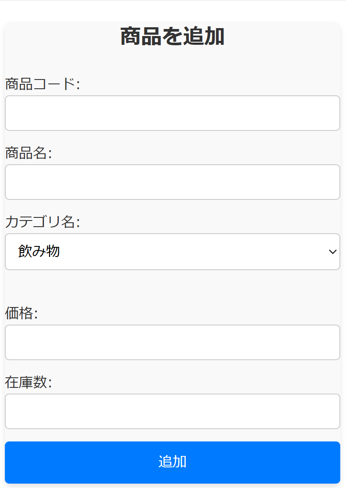

* 商品コード：一意な任意の文字列を割り当ててください。
* 商品名：任意の商品名を入力してください。
* カテゴリ名：登録済みカテゴリから選択してください。
* 価格：商品の価格を入力してください。
* 在庫数：商品の在庫数を入力してください。

### 7.2. カテゴリの追加-編集

URL > <http://localhost:8080/adminUI/admin.php#category-editor>

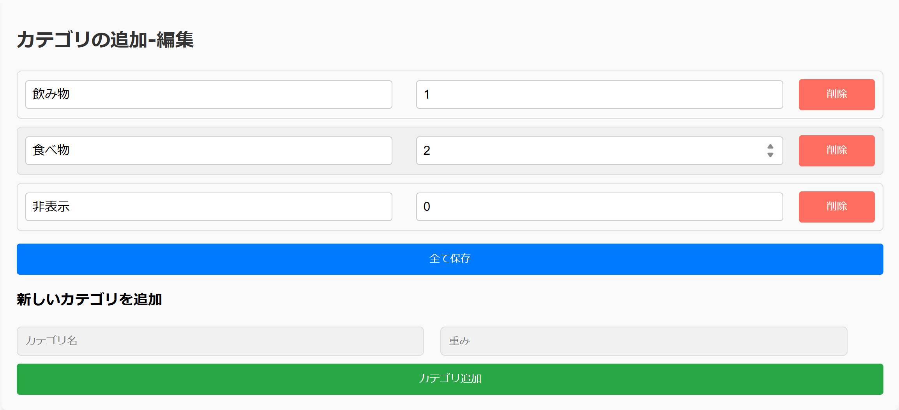

* カテゴリ名：任意のカテゴリ名を入力してください。
* 重み付け：カテゴリの重み付けを入力してください。（レジ画面で重みが小さいものから順に表示されます。0は非表示を示します）
* すべて保存をクリックするとその時点で画面に映っている内容で保存されます。
* 追加する際は同様に追加用のエリアに入力し、カテゴリ追加ボタンを押してください。
* 削除する際は削除したいカテゴリの行の削除ボタンを押してください。

### 7.3. 決済履歴-売り上げの表示

URL > <http://localhost:8080/adminUI/admin.php#payment-log>

* 上部に合計金額と現金決済分の金額が表示されます。
* 表に決済履歴が表示されます。
* 注文番号は自動で設定される一意な値です。
* 注文番号が赤く表示されているものは、決済が完了していないものです。（合計金額には含まれません）
* 詳細をクリックすることで該当する注文の詳細を表示します。

#### 詳細ポップアップ

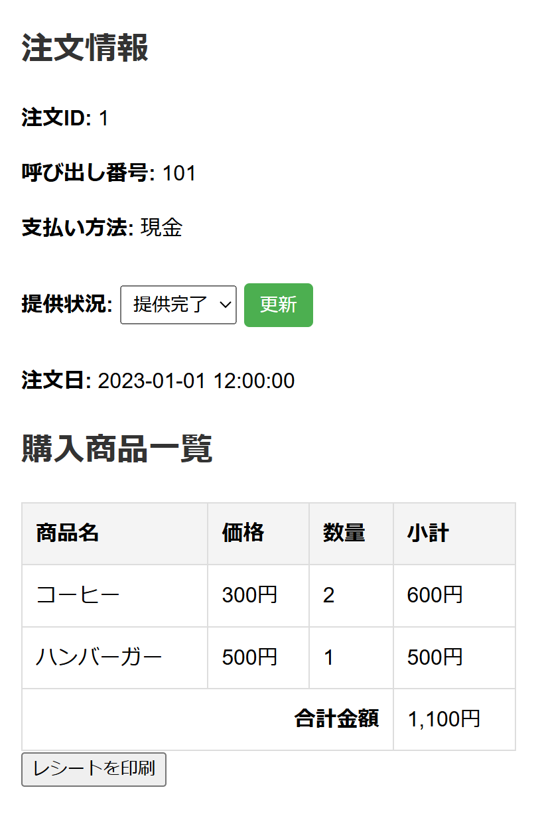

* 注文ID：一意な値です。
* 呼び出し番号：呼び出しパネルに表示される番号です。(一意ではない場合があります)
* 支払い方法：決済方法を表示します。（電子決済の場合完了したかも表示されます）
* 提供状況：注文の状態を表示します。変更して更新すると状態が変更されます。
* 注文日：注文が行われた日時を表示します。
* 購入商品一覧：購入した商品の一覧を表示します。
* レシートの印刷ボタンはサーマルプリンターを有効化している場合のみ表示されます。クリックすることでレシートの再発行ができます。

### 7.4. 機能の設定  

URL > <http://localhost:8080/adminUI/admin.php#function-toggle>  
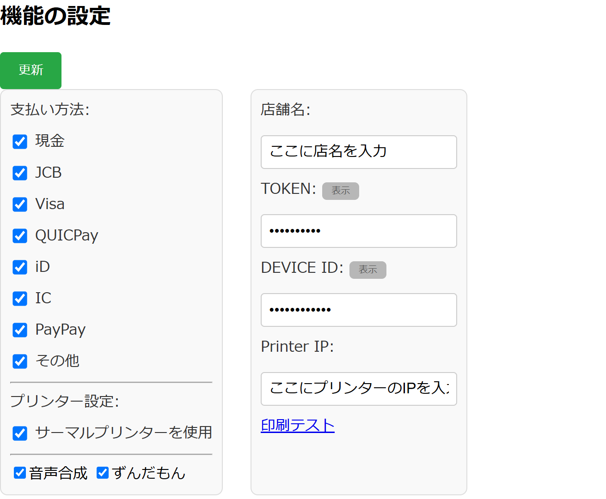

* 更新ボタン：設定を保存します。
* 支払い方法：利用可能な決済方法を選択します。
* サーマルプリンター ：サーマルプリンターを有効化します。
* 合成音声：合成音声を有効化します。
* ずんだもん：ずんだもんを有効化します。（無効化するとカスタム音源が使えます）
* 店舗名：店舗名を設定します。
* TOKEN：スクエアターミナルのトークンを設定します。
* DEVICEID：スクエアターミナルのデバイスIDを設定します。
* Printer IP：サーマルプリンターのIPアドレスを設定します。
* 印刷テスト：サーマルプリンターの印刷テストを行います。  

### 7.5. その他  

URL > <http://localhost:8080/adminUI/admin.php#other-settings>  

* csv出力：データベース内の各テーブルをCSV形式で出力します。
* 設定ファイルのエクスポート：設定ファイルをjson形式でエクスポートします。
* 設定ファイルのインポート：設定ファイルをjson形式でインポートします。
* データベースのリセット：データベースを初期化します。  

---

## 8. 呼び出しパネルの説明

### 8.1. 呼び出しパネル(大)

URL > <http://localhost:8080/announcementPanel/full.php>  
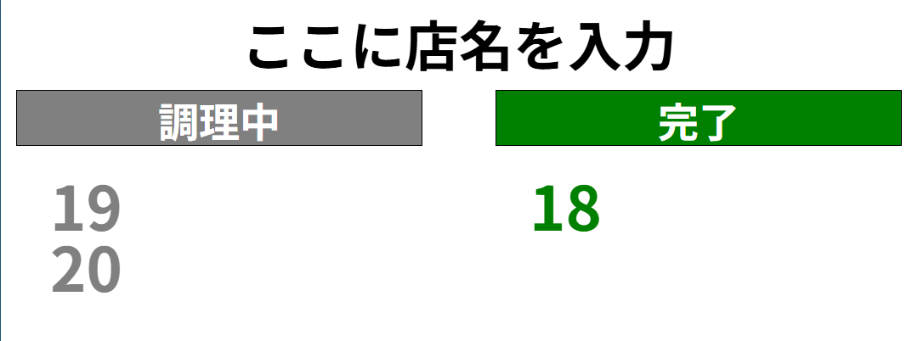
現在の調理状況を表示します  
キッチン管理画面から調理状況は変更できます  
※画面の大きさによってある程度文字の配列は変わりますが極端に大きい・小さい場合意図しない動きをする場合があります

### 8.2. 呼び出しパネル(調理中)

URL > <http://localhost:8080/announcementPanel/division1.php>
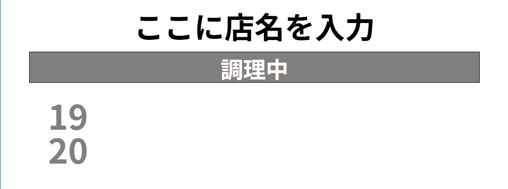
呼び出しパネル(大)の縮小版です。24inモニタなどにご利用ください。  
表示されるものは`調理中`のみです。

### 8.3. 呼び出しパネル(完了)  

URL > <http://localhost:8080/announcementPanel/division2.php>  
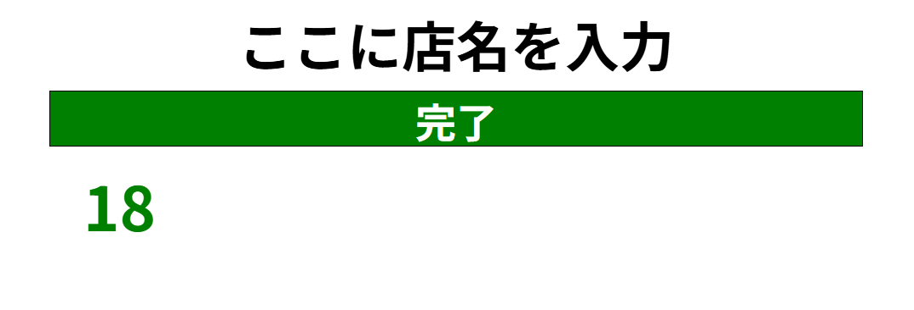
呼び出しパネル(大)の縮小版です。24inモニタなどにご利用ください。  
表示されるものは`完了`のみです。

---

## 9. キッチン管理画面の説明

### 9.1. キッチン管理画面

URL > <http://localhost:8080/kitchenUI/kitchen_mng.php>

---

## 10. Cash registerの説明

### 10.1. Cash register

URL > <http://localhost:8080/register/register.php>
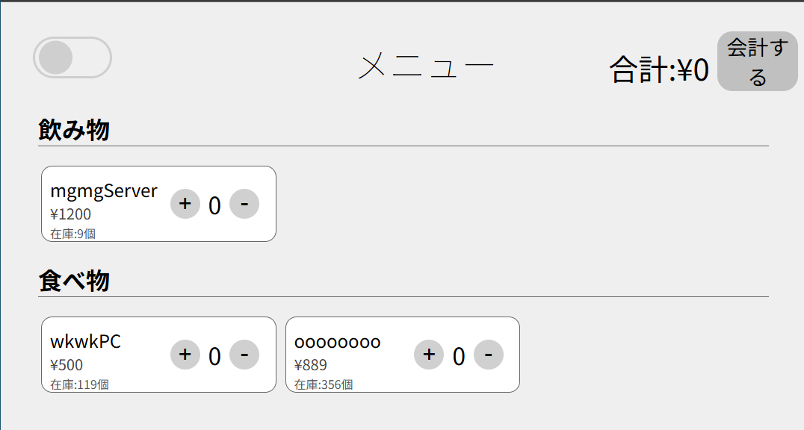

* 商品の購入から支払いまでをスムーズにします  
* 画面左上：画面の色を変えれます(ライト/ダーク)  
* 画面右上：合計金額と支払いへ進むボタンがあります  
* 商品の購入には商品枠内の(+/-)ボタンを押します  

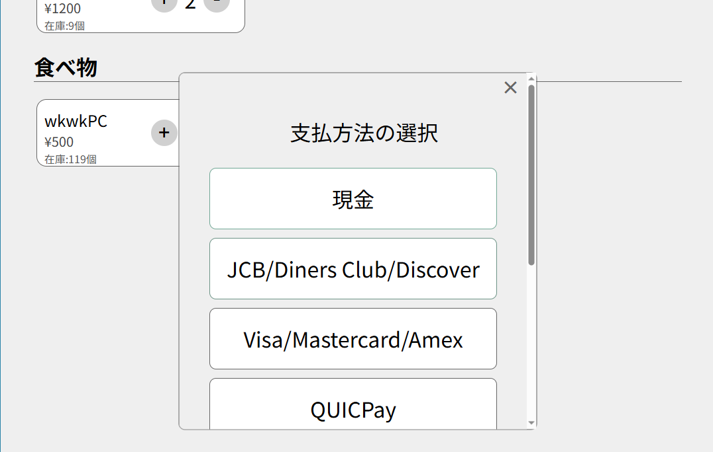

* 会計するボタンを押すとAdmin-機能設定で設定された支払い方法が表示されます  

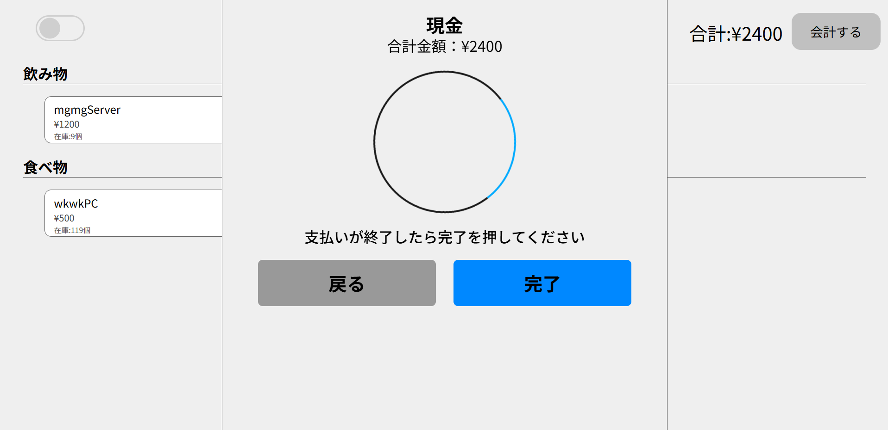

* 支払い方法を選択したら支払い待機画面が表示されます  
* 支払い待機画面では支払いの完了及びキャンセルが選択可能です  

> **注:** キャンセルをした場合支払い方法選択画面へ戻ります  

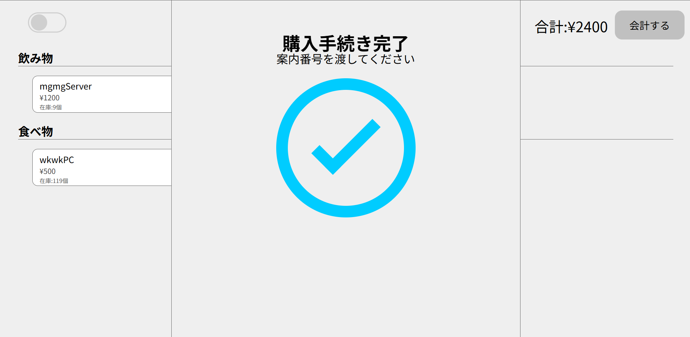

* プリンターがある場合は完了を押したら支払い完了になります  

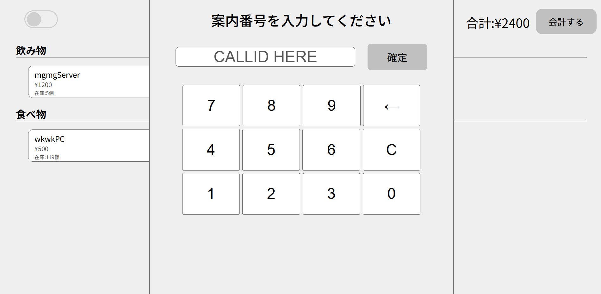

* プリンターがない場合は案内番号(任意)を入力した後完了となります  

> **注:** 指定した番号と紙等で渡す番号は間違えないよう注意してください

---

## 11. これ以下はメモ

## 12. 応用的な使い方・ヒント

### 呼び出し音声の変更

呼び出し音声の変更が可能です。  
path `./html/kitchenUI`にある`himari`or`zundamon`の音声ファイルを差し替えることで読み上げ音声を変更することができます。

### ログイン画面の追加

セキュリティ保護のためにアクセスする際のログイン機能を追加することが可能です。  
詳細は path `./apache/README.md`をご覧ください。

---

## 13. トラブルシューティング

システムの使用中に発生する可能性のある問題と、その解決策をまとめました。

### 13.1. \[問題1]: \[物販中/後に価格を変更すると既に販売済みのものも変更されてしまう]

* **原因**: 集計の際に販売された個数とDB上の商品価格を参照するため
* **解決策**:
    1. 商品の販売後に商品価格を変更しない
    2. 割引をする場合は割引後の価格を設定した商品を追加する

### 13.1. \[問題1]: \[設定をインポートした際に保存することができなくなる]

* **原因**: `settings.json`の権限が変更されてしまうため
* **解決策**:
    1. コンテナをリスタートする事で権限が自動修正されます

---

## 14. FAQ (よくある質問)

Q: \[質問1]  
なぜサーマルプリンタの接続がEthernet何ですか？  
A: \[回答1]  

* 安かったから
* サンプルがあったから
* シリアル変換ケーブルが高かったから

---

## 15. 用語集

* Square > Square株式会社(日本法人)が運営している決済代行サービスAPIを経由して電子決済に対応させることができます。
* TOKEN > SquareAPIのアプリケーションTOKENです。
* DEVICEID > SquareTerminalのDEVICEIDです。
* サーマルプリンタ > お店でレシート出てくる機械。
* 注文ID > 注文を受け付けた際に通しでつけられる番号です。
* 呼び出し番号 > 呼び出しの際に使用される番号です。

---

## 16. 付録

### 16.1. ライセンス情報

#### 呼び出し音声クレジット

* VOICEVOX：ずんだもん
* VOICEVOX:冥鳴ひまり

[ライセンス情報を記述]

### 16.2. 問い合わせ先

Xアカウント : @kurappy14

---

## 17. 改訂履歴

| 日付   | バージョン | 変更内容       |
| :----- | :--------- | :------------- |
| [日付] | [vX.Y.Z]   | 初版作成       |
| [日付] | [vX.Y.Z]   | [変更点の概要] |
| [日付] | [vX.Y.Z]   | [変更点の概要] |
