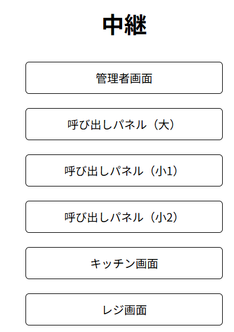

# 画面単位技術仕様

## 概要

ここでは個々細かな技術仕様が記載されています。

## 目次

- [画面単位技術仕様](#画面単位技術仕様)
  - [概要](#概要)
  - [目次](#目次)
  - [HOMEの説明](#homeの説明)
  - [Adminの説明](#adminの説明)
    - [商品の追加-編集](#商品の追加-編集)
    - [カテゴリの追加-編集](#カテゴリの追加-編集)
    - [決済履歴-売り上げの表示](#決済履歴-売り上げの表示)
    - [機能の設定](#機能の設定)
    - [その他](#その他)
  - [呼び出しパネルの説明](#呼び出しパネルの説明)
    - [呼び出しパネル](#呼び出しパネル)
    - [呼び出しパネル(調理中)](#呼び出しパネル調理中)
    - [呼び出しパネル(完了)](#呼び出しパネル完了)
  - [キッチン管理画面の説明](#キッチン管理画面の説明)
  - [Cash register](#cash-register)

## HOMEの説明

URL > `localhost:8080`

## Adminの説明

URL > `localhost:8080/adminUI/admin.php`  

### 商品の追加-編集  

URL > `localhost:8080/adminUI/admin.php#product-editor`  

### カテゴリの追加-編集

URL > `localhost:8080/adminUI/admin.php#category-editor`  

### 決済履歴-売り上げの表示  

URL > `localhost:8080/adminUI/admin.php#payment-log`  

### 機能の設定  

URL > `localhost:8080/adminUI/admin.php#function-toggle`  

### その他  

URL > `localhost:8080/adminUI/admin.php#other-settings`  

## 呼び出しパネルの説明

### 呼び出しパネル

URL > `localhost:8080/announcementPanel/full.php`

### 呼び出しパネル(調理中)

URL > `localhost:8080/announcementPanel/division1.php`

### 呼び出しパネル(完了)

URL > `localhost:8080/announcementPanel/division2.php`

## キッチン管理画面の説明

URL > `localhost:8080/kitchenUI/kitchen_mng.php`

## Cash register  

URL > `localhost:8080/register/register.php`  
